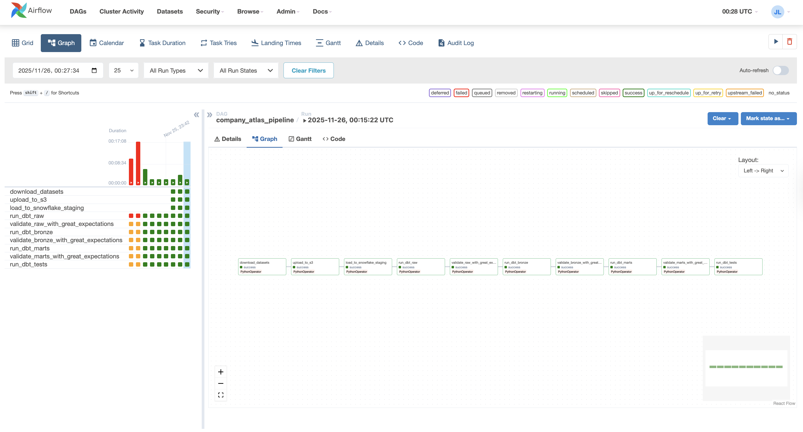

<div align="center">

<div style="display: flex; align-items: center; justify-content: center; gap: 1.5rem; margin-bottom: 1rem;">
  
  <h1 style="margin: 0; display: inline-block; text-decoration: none; border-bottom: none;">Company Atlas</h1>
</div>

**A unified firmographic data platform with thousands of companies from open-source datasets**

<br>

<div align="center">

[](https://coresheep.github.io/company-atlas/)
&nbsp;
[](LICENSE)
&nbsp;
[](https://jiufengblog.web.app/)

</div>

<br>

<div align="center">

[](https://www.python.org/)
&nbsp;
[](https://fastapi.tiangolo.com/)
&nbsp;
[](https://www.getdbt.com/)
&nbsp;
[](https://airflow.apache.org/)
&nbsp;
[](https://greatexpectations.io/)
&nbsp;
[](https://aws.amazon.com/)
&nbsp;
[](https://www.snowflake.com/)
&nbsp;
[](https://pages.github.com/)

</div>

<br>

<div align="center">

**Author**: [Jiufeng Li](https://jiufengblog.web.app/) • **Year**: 2025

**Official Website**: <https://coresheep.github.io/company-atlas/>

</div>

<br>

<div align="center">


</div>

</div>

## Overview

Company Atlas collects, cleans, and normalizes firmographic data from multiple sources, producing an analytics-ready dataset with thousands of companies worldwide. The platform features an elegant interactive website, live dashboards, and a comprehensive REST API for data access.

> **Note**: Currently, the dataset contains the top 1000 Fortune American companies. In the future, we plan to expand the dataset to include more companies worldwide.

### Key Highlights

- **Multi-Source Data**: Combines Kaggle Fortune 1000 dataset with web crawler enrichment
- **Automated Pipeline**: End-to-end data processing with Airflow orchestration
- **Data Quality**: Comprehensive validation with dbt tests and Great Expectations
- **Interactive Dashboards**: Real-time visualizations and company profiles
- **REST API**: FastAPI-based API with interactive documentation
- **Production Ready**: Deployed on GitHub Pages with CI/CD automation

## Architecture

<div align="center">


</div>

The architecture diagram above illustrates the complete data pipeline flow from data sources to the final user-facing website. The system integrates multiple components:

- **Data Sources**: Kaggle open-source datasets (e.g., [2024 Fortune 1000 Companies](https://www.kaggle.com/datasets/jeannicolasduval/2024-fortune-1000-companies)) and Python web crawlers
- **Cloud Storage**: Amazon Web Services S3 for raw data storage
- **Data Warehouse**: Snowflake for staging and data warehousing
- **Data Pipelines**: Staging → Raw → Bronze → Marts (dbt transformation layers)
- **Orchestration**: Apache Airflow for workflow automation
- **Data Transformation**: dbt for modeling, transformation, validation, and marts creation
- **API & Presentation**: FastAPI REST API and Company Atlas Website

## Features

### Statistics Dashboard

<div align="center">


</div>

- **Total Companies**: Count of all companies in the dataset
- **Total Revenue**: Aggregate revenue across all companies
- **Industries**: Number of unique industries
- **Average Employees**: Mean employee count

### Company Profiles

<div align="center">


</div>

- **Top Companies by Market Cap**: Display of leading companies with logos
- **Company Details**: Market cap, Fortune rank, industry, revenue, employees, founded year
- **Interactive Cards**: Elegant company profile cards with visual hierarchy

### Live Dashboards

Interactive carousel with multiple visualizations:
- **Top Industries**: Bar chart showing industry distribution
- **Revenue Distribution**: Histogram of company revenues
- **City Distribution**: Geographic distribution of company headquarters
- **Employee Count Distribution**: Workforce size analysis
- **Revenue % Change**: Year-over-year revenue growth/decline
- **Revenue Growth & Decline**: Combined visualization of top performers

### Interactive Search

<div align="center">


</div>

- Search by company name or CEO name
- Real-time filtering and results display
- Sortable table with key company metrics
- Displays: company name, ticker, CEO, founded year, domain, industry, headquarters, market cap, revenue

### REST API

<div align="center">


</div>

FastAPI-based RESTful API with comprehensive endpoints:
- `GET /api/v1/companies` - Search and retrieve companies with filtering
- `GET /api/v1/companies/{id}` - Get specific company by ID
- `GET /api/v1/statistics` - Dataset statistics and distributions
- `GET /api/v1/industries` - List of all industries
- `GET /api/v1/countries` - List of all countries

**Interactive Documentation**: Available at `/docs` endpoint with Swagger UI

## Data Pipelines

### 1. Data Collection

**Multi-Source Ingestion:**
- **Kaggle Datasets**: Downloads Fortune 1000 2024 dataset from Kaggle
- **Web Crawler**: Enriches company data by scraping additional information (founded year, company details) from web sources
- Data is collected asynchronously using `trio` for efficient concurrent processing

### 2. Data Ingestion

**S3 Storage:**
- Raw data files (CSV and Parquet formats) are uploaded to AWS S3 buckets
- Files are organized by source: `fortune1000/` and `global_companies/`

**Snowflake Staging:**

<div align="center">


</div>

- Data is loaded from S3 to Snowflake staging tables using external stages
- `COPY INTO` commands with proper file format configurations (CSV with header parsing)
- Staging tables: `STG_FORTUNE1000`, `STG_GLOBAL_COMPANIES`

### 3. Data Modeling and Transformation with dbt

<div align="center">


</div>

**Transformation Layers:**
- **Raw Layer**: Initial data cleaning and normalization
  - `raw_dim_companies`: Unified company dimension table
  - `raw_fct_company_metrics`: Company metrics and financial data
- **Bronze Layer**: Data quality validation and standardization
  - `bronze_dim_companies`: Cleaned company master data
  - `bronze_fct_company_metrics`: Validated metrics data
- **Marts Layer**: Analytics-ready unified tables
  - `unified_companies`: Final star schema with joined dimension and fact tables

**Data Quality:**
- Automatic tests using dbt:
  - Uniqueness tests on `company_name`
  - Not null constraints on key fields
  - Range validation (e.g., Fortune rank 1-1000)
  - Relationship integrity checks
- Comprehensive validation using Great Expectations:
  - **Raw Layer Validation**: Validates `raw_dim_companies` and `raw_fct_company_metrics`
    - Column existence checks (company_id, company_name, source_system)
    - Not null constraints on key fields (mostly 95-99% threshold)
    - Range validation: founded_year (1800-2030), fortune_rank (1-1000)
  - **Bronze Layer Validation**: Validates `bronze_dim_companies` and `bronze_fct_company_metrics`
    - Uniqueness checks on company_id and company_name (mostly 99% threshold)
    - Enhanced data quality with stricter not null constraints
    - Range validation: founded_year, fortune_rank, employee_count (>= 0)
  - **Marts Layer Validation**: Validates `unified_companies` (analytics-ready data)
    - Uniqueness checks on company_id and company_name
    - Not null constraints on country, source_system
    - Range validation: founded_year, fortune_rank, employee_count
    - Schema validation and data type enforcement

**Metadata & Catalog Management:**

dbt serves as a centralized metadata management and data catalog platform, providing:

- **Business Metadata**:
  - Model descriptions and documentation
  - Data owner and domain assignments
  - PII (Personally Identifiable Information) flags for sensitive columns
  - SLA (Service Level Agreement) definitions for data freshness
  - Business glossary and terminology definitions

- **Technical Metadata**:
  - Schema definitions and column data types
  - Source system tracking (`source_system` field)
  - Transformation logic documentation
  - Materialization strategies (table, view, incremental)

- **Data Lineage**:
  - End-to-end lineage from source to marts
  - Column-level lineage tracking
  - Impact analysis for downstream dependencies
  - Visual DAG representation

<div align="center">


</div>

The lineage graph above shows the complete data flow from staging tables through raw, bronze, and marts layers, demonstrating how data is transformed and validated at each stage.

**Generate dbt Documentation:**

```bash
dbt docs generate # Generate the docs website
dbt docs serve # Serve the docs website
```

The docs website will be available at `http://localhost:8000`.

### 4. Orchestration

**Apache Airflow:**

<div align="center">



</div>

- DAG: `company_atlas_pipeline` orchestrates the complete data flow
- Schedule: Manual trigger (configurable to daily with `schedule_interval=timedelta(days=1)`)
- Max active runs: 1 (prevents concurrent executions)
- Retries: 2 attempts with 5-minute delay

**Pipeline Tasks (10 steps):**

| Step | Task ID | Description |
|------|---------|-------------|
| 1 | `download_datasets` | Download Fortune 1000 from Kaggle (`jeannicolasduval/2024-fortune-1000-companies`) |
| 2 | `upload_to_s3` | Upload `fortune1000_2024.csv` and `fortune1000_companies.csv` to S3 |
| 3 | `load_to_snowflake_staging` | Load data from S3 to Snowflake staging tables |
| 4 | `run_dbt_raw` | Run dbt raw layer models for initial data cleaning |
| 5 | `validate_raw_with_great_expectations` | Validate raw layer data quality |
| 6 | `run_dbt_bronze` | Run dbt bronze layer models for standardization |
| 7 | `validate_bronze_with_great_expectations` | Validate bronze layer data quality |
| 8 | `run_dbt_marts` | Run dbt marts layer models for analytics-ready tables |
| 9 | `validate_marts_with_great_expectations` | Validate marts layer data quality |
| 10 | `run_dbt_tests` | Run comprehensive dbt data quality tests |

**Task Dependencies:**
```
download_datasets → upload_to_s3 → load_to_snowflake_staging → run_dbt_raw → 
validate_raw_with_great_expectations → run_dbt_bronze → validate_bronze_with_great_expectations → 
run_dbt_marts → validate_marts_with_great_expectations → run_dbt_tests
```

### 5. Data Transformation

**dbt Models:**
- Incremental materialization for efficient updates
- Column normalization and type casting
- Deduplication across multiple sources
- Schema unification (star schema design)
- Automatic timestamp tracking (`loaded_at`, `last_updated_at`)

### 6. Data Visualization

**Interactive Website:**
- Live dashboards with Chart.js visualizations
- Real-time statistics and company profiles
- Interactive search functionality
- Responsive design for mobile and desktop

## API Documentation

Full API documentation is available on the website:

- **Website Documentation**: <https://coresheep.github.io/company-atlas/docs/api.html>
- **Interactive API Docs**: <http://localhost:8000/docs> (when running locally)
- **ReDoc**: <http://localhost:8000/redoc> (when running locally)

### Example Usage

**Python:**
```python
import requests

# Search for Apple by company name
response = requests.get(
    "http://localhost:8000/api/v1/companies",
    params={
        "company_name": "Apple",
        "page": 1,
        "page_size": 10
    }
)

companies = response.json()
print(f"Found {companies['total']} companies")
for company in companies['companies']:
    print(f"- {company['company_name']} ({company['domain']})")
    print(f"  Industry: {company['industry']}")
    print(f"  Revenue: ${company['revenue']:,.0f}")
    print(f"  Employees: {company['employee_count']:,}")
```

**cURL:**
```bash
# Get statistics
curl "http://localhost:8000/api/v1/statistics"

# Search for Apple
curl "http://localhost:8000/api/v1/companies?company_name=Apple"

# Get specific company by ID
curl "http://localhost:8000/api/v1/companies/{company_id}"
```

## Technology Stack

- **Data Collection**: Kaggle API, Web Scraping (httpx, BeautifulSoup, trio)
- **Cloud Storage**: AWS S3
- **Data Warehouse**: Snowflake
- **Data Transformation**: dbt (Data Build Tool)
- **Orchestration**: Apache Airflow
- **API**: FastAPI, Uvicorn
- **Frontend**: HTML5, CSS3, JavaScript, Chart.js
- **Deployment**: GitHub Pages

## Project Structure

```
company-atlas/
├── airflow/               # Apache Airflow orchestration
│   └── dags/             # Airflow DAG definitions
│       └── company_atlas_pipeline.py
├── pipelines/             # Data pipeline scripts
│   ├── ingestion/        # Data ingestion (Kaggle, web crawler)
│   │   ├── main_ingestion.py
│   │   ├── kaggle_ingestion.py
│   │   └── web_scraper.py
│   ├── staging/           # S3 to Snowflake loading
│   │   ├── upload_to_s3.py
│   │   ├── run_load_script.py
│   │   └── load_data_from_s3.sql
│   ├── validation/       # Great Expectations validation
│   │   └── great_expectations_setup.py
│   ├── marts/            # Marts data download
│   │   └── download_unified_companies.py
│   └── website/          # Logo fetching and website utilities
│       └── fetch_company_logos.py
├── dbt/                  # dbt models and tests
│   ├── models/
│   │   ├── raw/          # Raw layer models
│   │   ├── bronze/       # Bronze layer models
│   │   └── marts/        # Analytics-ready marts
│   ├── tests/            # dbt test definitions
│   │   ├── raw/
│   │   ├── bronze/
│   │   └── marts/
│   ├── macros/           # dbt macros
│   └── dbt_project.yml   # dbt configuration
├── api/                  # FastAPI REST API
│   ├── main.py
│   └── models/
├── website/              # GitHub Pages website
│   ├── index.html
│   ├── assets/
│   │   ├── css/
│   │   ├── js/
│   │   └── logos/
│   ├── data/             # Website data files
│   └── docs/
│       └── api.html
├── data/                 # Local data storage
│   ├── raw/              # Raw data files
│   └── marts/            # Processed data
├── images/               # Documentation images
├── architecture/         # Architecture diagrams
├── docker-compose.yml    # Docker Compose configuration for Airflow
├── LICENSE               # MIT License
├── requirements.txt      # Python dependencies
└── environment.yml       # Conda environment file
```

## Setup

### Prerequisites

- Python 3.9+
- Docker and Docker Compose
- Snowflake account with key-pair authentication
- AWS account with S3 access
- Kaggle API credentials

### Required Credentials & Configuration Files

Before setting up the project, ensure you have the following credentials configured:

#### 1. Snowflake Private Key (MFA Authentication)

Snowflake requires key-pair authentication for accounts with MFA enabled. Generate and configure your private key:

```bash
# Generate RSA key pair (if not already done)
openssl genrsa 2048 | openssl pkcs8 -topk8 -inform PEM -out rsa_key.p8 -nocrypt

# Extract public key for Snowflake
openssl rsa -in rsa_key.p8 -pubout -out rsa_key.pub

# Add public key to your Snowflake user
# In Snowflake: ALTER USER <username> SET RSA_PUBLIC_KEY='<public_key_content>';
```

Store your private key in a secure location (e.g., `~/Documents/project/snowflake-key/rsa_key.p8`).

#### 2. Environment Variables (.env file)

Create a `.env` file in your home directory (`~/.env`) with the following variables:

```bash
# Snowflake Configuration
SNOWFLAKE_ACCOUNT=your_account_identifier
SNOWFLAKE_USER=your_username
SNOWFLAKE_ROLE=TRANSFORM
SNOWFLAKE_WAREHOUSE=COMPUTE_WH
SNOWFLAKE_DATABASE=COMPANY_ATLAS
SNOWFLAKE_SCHEMA=RAW
SNOWFLAKE_PRIVATE_KEY_PATH=/path/to/your/rsa_key.p8

# AWS S3 Configuration
AWS_ACCESS_KEY_ID=your_aws_access_key
AWS_SECRET_ACCESS_KEY=your_aws_secret_key
S3_BUCKET_NAME=company-atlas-YYYYMM

# Kaggle API (optional if using ~/.kaggle/kaggle.json)
KAGGLE_USERNAME=your_kaggle_username
KAGGLE_KEY=your_kaggle_api_key
```

#### 3. Kaggle API Credentials

Download your Kaggle API token from [Kaggle Account Settings](https://www.kaggle.com/settings) and place it at:

```bash
~/.kaggle/kaggle.json
```

Ensure proper permissions:
```bash
chmod 600 ~/.kaggle/kaggle.json
```

#### 4. AWS S3 Bucket

Create an S3 bucket for storing raw data files:
```bash
aws s3 mb s3://company-atlas-YYYYMM
```

---

### Option A: Docker + Airflow Setup (Recommended)

This is the recommended approach for running the complete data pipeline with orchestration.

#### 1. Clone the repository:
```bash
git clone https://github.com/CoreSheep/company-atlas.git
cd company-atlas
```

#### 2. Configure Docker volume mounts

The `docker-compose.yml` mounts the following paths (update if your paths differ):

| Host Path | Container Path | Purpose |
|-----------|----------------|---------|
| `~/.env` | `/opt/airflow/.env` | Environment variables |
| `~/.kaggle` | `/root/.kaggle` | Kaggle API credentials |
| `/path/to/rsa_key.p8` | `/opt/airflow/snowflake_rsa_key.p8` | Snowflake private key |

> **Note**: Update the Snowflake private key path in `docker-compose.yml` to match your local path.

#### 3. Build and start Docker containers:
```bash
# Build Docker images
docker-compose build

# Start all services (PostgreSQL, Airflow Webserver, Airflow Scheduler)
docker-compose up -d

# Check container status
docker-compose ps
```

#### 4. Access Airflow Web UI:
- **URL**: http://localhost:8080
- **Username**: `airflow_company_atlas`
- **Password**: `CompanyAtlas123!`

#### 5. Run the data pipeline:
- Unpause the `company_atlas_pipeline` DAG in the Airflow UI
- Click "Trigger DAG" to run the complete pipeline
- Monitor task progress in the Graph or Tree view

**Pipeline Tasks (10 steps):**
1. `download_datasets` - Download Fortune 1000 from Kaggle
2. `upload_to_s3` - Upload CSV files to S3
3. `load_to_snowflake_staging` - Load data to Snowflake staging
4. `run_dbt_raw` - dbt raw layer transformation
5. `validate_raw_with_great_expectations` - Validate raw layer
6. `run_dbt_bronze` - dbt bronze layer transformation
7. `validate_bronze_with_great_expectations` - Validate bronze layer
8. `run_dbt_marts` - dbt marts layer transformation
9. `validate_marts_with_great_expectations` - Validate marts layer
10. `run_dbt_tests` - Run dbt data quality tests

#### 6. Stop services:
```bash
docker-compose down
```

---

### Option B: Manual Setup

For development or running individual pipeline components without Docker.

#### 1. Clone the repository:
```bash
git clone https://github.com/CoreSheep/company-atlas.git
cd company-atlas
```

#### 2. Create and activate conda environment:
```bash
conda env create -f environment.yml
conda activate company-atlas
```

Or install with pip:
```bash
pip install -r requirements.txt
```

#### 3. Configure environment variables:
```bash
# Source environment variables
source ~/.env
```

#### 4. Configure dbt:
```bash
cd dbt
dbt deps
cd ..
```

#### 5. Run pipeline steps manually (alternative):

```bash
# Step 1: Download datasets from Kaggle
python pipelines/ingestion/download_datasets.py

# Step 2: Upload to S3
python pipelines/staging/upload_to_s3.py

# Step 3: Load to Snowflake staging
python pipelines/staging/run_load_script.py

# Step 4-5: Run dbt raw layer and tests
cd dbt
bash run_dbt.sh run --select raw
bash run_dbt.sh test --select raw

# Step 6-7: Run dbt bronze layer and tests
bash run_dbt.sh run --select bronze
bash run_dbt.sh test --select bronze

# Step 8-9: Run dbt marts layer and tests
bash run_dbt.sh run --select marts
bash run_dbt.sh test --select marts

# Step 10: Run all dbt tests
bash run_dbt.sh test
cd ..

# Optional: Run Great Expectations validation
python -c "from pipelines.validation.great_expectations_setup import GreatExpectationsValidator; v = GreatExpectationsValidator(); v.validate_all_layers()"
```

#### 6. Start the API server (optional):
```bash
cd api
uvicorn main:app --reload --port 8000
# API available at http://localhost:8000
# Docs at http://localhost:8000/docs
```

## Citation

If you use Company Atlas in your research or project, please cite:

```
Li, J. (2025). Company Atlas: A Unified Firmographic Data Platform. 
<https://coresheep.github.io/company-atlas/>
```

**Author**: [Jiufeng Li](https://jiufengblog.web.app/)  
**Project Website**: <https://coresheep.github.io/company-atlas/>  
**Year**: 2025

## License

This project is licensed under the MIT License - see the [LICENSE](LICENSE) file for details.

Copyright (c) 2025 [Jiufeng Li](https://jiufengblog.web.app/)
