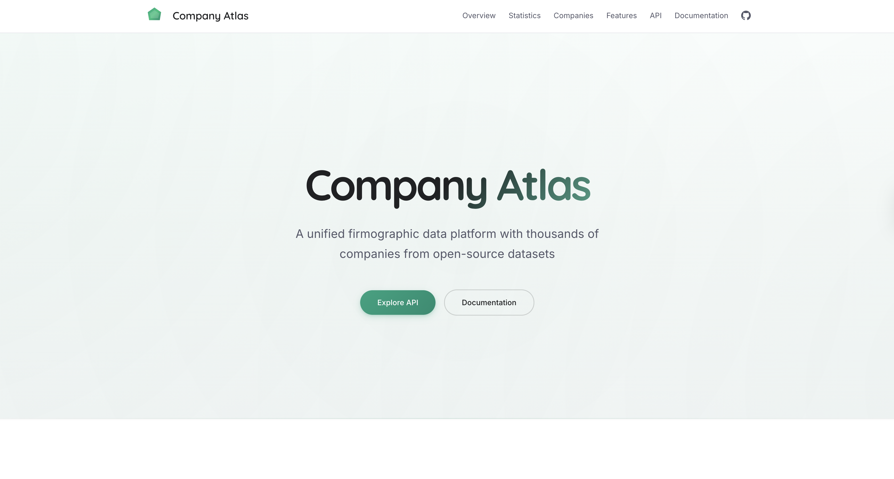
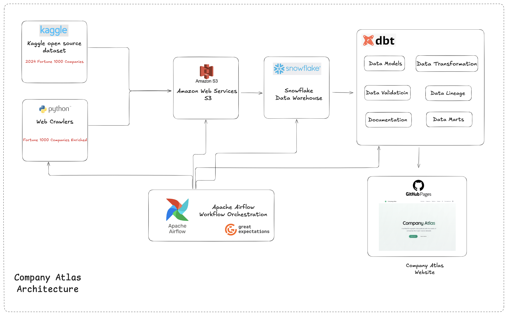
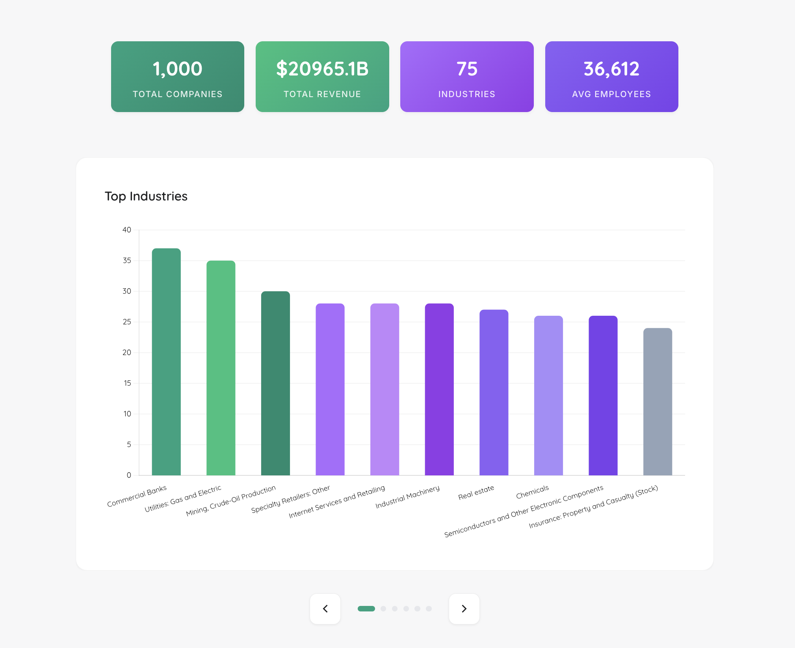
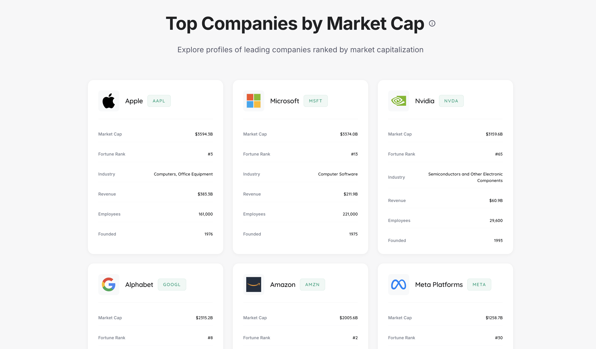
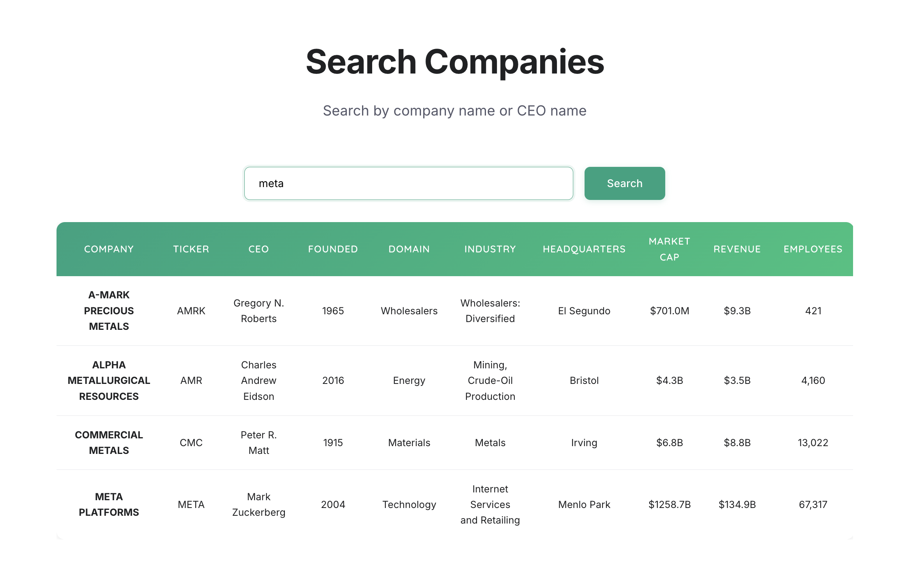
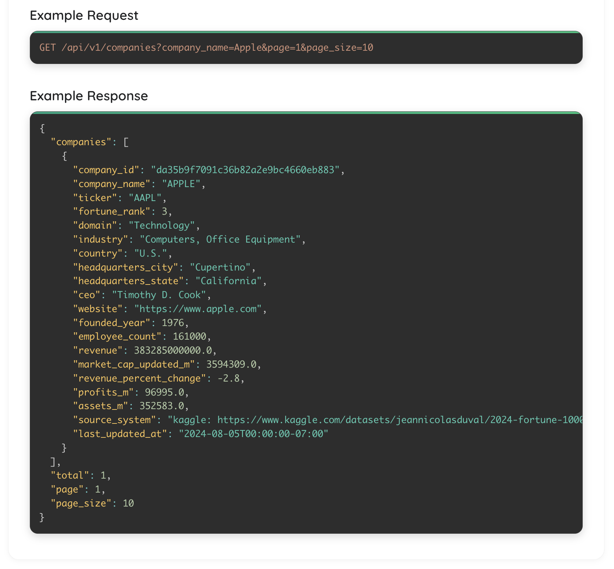
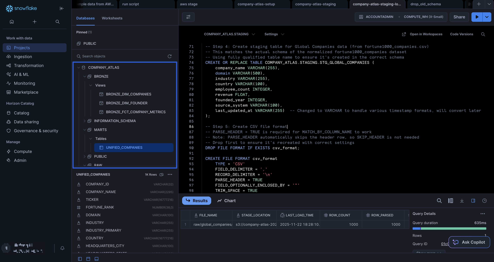
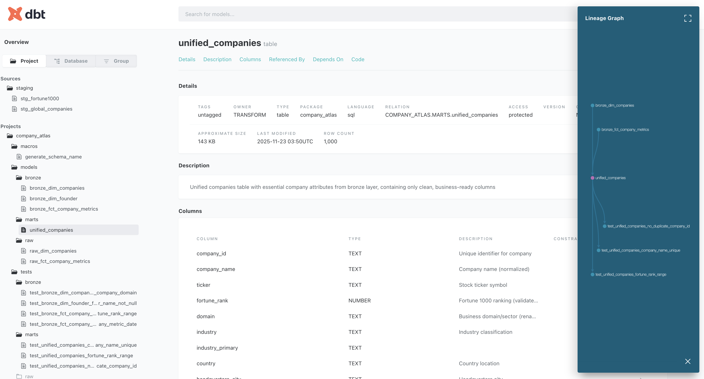
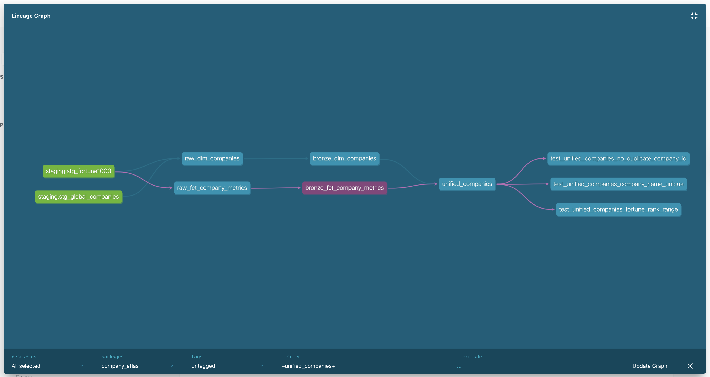

<div align="center">

<div style="display: flex; align-items: center; justify-content: center; gap: 1.5rem; margin-bottom: 1rem;">
  
  <h1 style="margin: 0; display: inline-block; text-decoration: none; border-bottom: none;">Company Atlas</h1>
</div>

**A unified firmographic data platform with thousands of companies from open-source datasets**

<br>

<div align="center">

[](https://coresheep.github.io/company-atlas/)
&nbsp;
[](LICENSE)
&nbsp;
[](https://jiufengblog.web.app/)

</div>

<br>

<div align="center">

[](https://www.python.org/)
&nbsp;
[](https://fastapi.tiangolo.com/)
&nbsp;
[](https://www.getdbt.com/)
&nbsp;
[](https://airflow.apache.org/)
&nbsp;
[](https://greatexpectations.io/)
&nbsp;
[](https://aws.amazon.com/)
&nbsp;
[](https://www.snowflake.com/)
&nbsp;
[](https://pages.github.com/)

</div>

<br>

<div align="center">

**Author**: [Jiufeng Li](https://jiufengblog.web.app/) • **Year**: 2025

**Official Website**: <https://coresheep.github.io/company-atlas/>

</div>

<br>

<div align="center">



</div>

</div>

## Overview

Company Atlas collects, cleans, and normalizes firmographic data from multiple sources, producing an analytics-ready dataset with thousands of companies worldwide. The platform features an elegant interactive website, live dashboards, and a comprehensive REST API for data access.

> **Note**: Currently, the dataset contains the top 1000 Fortune American companies. In the future, we plan to expand the dataset to include more companies worldwide.

### Key Highlights

- **Multi-Source Data**: Combines Kaggle Fortune 1000 dataset with web crawler enrichment
- **Automated Pipeline**: End-to-end data processing with Airflow orchestration
- **Data Quality**: Comprehensive validation with dbt tests and Great Expectations
- **Interactive Dashboards**: Real-time visualizations and company profiles
- **REST API**: FastAPI-based API with interactive documentation
- **Production Ready**: Deployed on GitHub Pages with CI/CD automation

## Architecture



The architecture diagram above illustrates the complete data pipeline flow from data sources to the final user-facing website. The system integrates multiple components:

- **Data Sources**: Kaggle open-source datasets and Python web crawlers
- **Cloud Storage**: Amazon Web Services S3 for raw data storage
- **Data Warehouse**: Snowflake for staging and data warehousing
- **Data Pipelines**: Staging → Raw → Bronze → Marts (dbt transformation layers)
- **Orchestration**: Apache Airflow for workflow automation
- **Data Transformation**: dbt for modeling, transformation, validation, and marts creation
- **API & Presentation**: FastAPI REST API and Company Atlas Website

## Features

### Statistics Dashboard



- **Total Companies**: Count of all companies in the dataset
- **Total Revenue**: Aggregate revenue across all companies
- **Industries**: Number of unique industries
- **Average Employees**: Mean employee count

### Company Profiles



- **Top Companies by Market Cap**: Display of leading companies with logos
- **Company Details**: Market cap, Fortune rank, industry, revenue, employees, founded year
- **Interactive Cards**: Elegant company profile cards with visual hierarchy

### Live Dashboards

Interactive carousel with multiple visualizations:
- **Top Industries**: Bar chart showing industry distribution
- **Revenue Distribution**: Histogram of company revenues
- **City Distribution**: Geographic distribution of company headquarters
- **Employee Count Distribution**: Workforce size analysis
- **Revenue % Change**: Year-over-year revenue growth/decline
- **Revenue Growth & Decline**: Combined visualization of top performers

### Interactive Search



- Search by company name or CEO name
- Real-time filtering and results display
- Sortable table with key company metrics
- Displays: company name, ticker, CEO, founded year, domain, industry, headquarters, market cap, revenue

### REST API



FastAPI-based RESTful API with comprehensive endpoints:
- `GET /api/v1/companies` - Search and retrieve companies with filtering
- `GET /api/v1/companies/{id}` - Get specific company by ID
- `GET /api/v1/statistics` - Dataset statistics and distributions
- `GET /api/v1/industries` - List of all industries
- `GET /api/v1/countries` - List of all countries

**Interactive Documentation**: Available at `/docs` endpoint with Swagger UI

## Data Pipelines

### 1. Data Collection

**Multi-Source Ingestion:**
- **Kaggle Datasets**: Downloads Fortune 1000 2024 dataset from Kaggle
- **Web Crawler**: Enriches company data by scraping additional information (founded year, company details) from web sources
- Data is collected asynchronously using `trio` for efficient concurrent processing

### 2. Data Ingestion

**S3 Storage:**
- Raw data files (CSV and Parquet formats) are uploaded to AWS S3 buckets
- Files are organized by source: `fortune1000/` and `global_companies/`

**Snowflake Staging:**


- Data is loaded from S3 to Snowflake staging tables using external stages
- `COPY INTO` commands with proper file format configurations (CSV with header parsing)
- Staging tables: `STG_FORTUNE1000`, `STG_GLOBAL_COMPANIES`

### 3. Data Modeling and Transformation with dbt



**Transformation Layers:**
- **Raw Layer**: Initial data cleaning and normalization
  - `raw_dim_companies`: Unified company dimension table
  - `raw_fct_company_metrics`: Company metrics and financial data
- **Bronze Layer**: Data quality validation and standardization
  - `bronze_dim_companies`: Cleaned company master data
  - `bronze_fct_company_metrics`: Validated metrics data
- **Marts Layer**: Analytics-ready unified tables
  - `unified_companies`: Final star schema with joined dimension and fact tables

**Data Quality:**
- Automatic tests using dbt:
  - Uniqueness tests on `company_name`
  - Not null constraints on key fields
  - Range validation (e.g., Fortune rank 1-1000)
  - Relationship integrity checks
- Comprehensive validation using Great Expectations:
  - **Raw Layer Validation**: Validates `raw_dim_companies` and `raw_fct_company_metrics`
    - Column existence checks (company_id, company_name, source_system)
    - Not null constraints on key fields (mostly 95-99% threshold)
    - Range validation: founded_year (1800-2030), fortune_rank (1-1000)
  - **Bronze Layer Validation**: Validates `bronze_dim_companies` and `bronze_fct_company_metrics`
    - Uniqueness checks on company_id and company_name (mostly 99% threshold)
    - Enhanced data quality with stricter not null constraints
    - Range validation: founded_year, fortune_rank, employee_count (>= 0)
  - **Marts Layer Validation**: Validates `unified_companies` (analytics-ready data)
    - Uniqueness checks on company_id and company_name
    - Not null constraints on country, source_system
    - Range validation: founded_year, fortune_rank, employee_count
    - Schema validation and data type enforcement

**Data Lineage:**


The lineage graph above shows the complete data flow from staging tables through raw, bronze, and marts layers, demonstrating how data is transformed and validated at each stage.

### 4. Orchestration

**Apache Airflow:**
- Automated workflow scheduling for the entire pipeline (daily schedule)
- DAG: `company_atlas_pipeline` orchestrates the complete data flow

**Pipeline Workflow:**
1. **Data Ingestion**: Kaggle datasets + Web crawler enrichment
2. **S3 Upload**: Upload raw CSV files to AWS S3
3. **Snowflake Staging**: Load data from S3 to Snowflake staging tables (`STG_FORTUNE1000`, `STG_GLOBAL_COMPANIES`)
4. **dbt Raw Layer**: Run raw layer models for initial data cleaning and normalization
5. **Great Expectations Raw Validation**: Validate raw layer data quality
6. **dbt Bronze Layer**: Run bronze layer models for data quality validation and standardization
7. **Great Expectations Bronze Validation**: Validate bronze layer data quality
8. **dbt Marts Layer**: Run marts layer models to create analytics-ready unified tables
9. **Great Expectations Marts Validation**: Validate marts layer data quality
10. **dbt Tests**: Run comprehensive data quality tests
11. **Website Data Download**: Download unified companies data for website visualization

**Task Dependencies:**
```
Ingestion → S3 Upload → Snowflake Staging → dbt Raw → GE Raw → 
dbt Bronze → GE Bronze → dbt Marts → GE Marts → dbt Tests → Website Download
```

### 5. Data Transformation

**dbt Models:**
- Incremental materialization for efficient updates
- Column normalization and type casting
- Deduplication across multiple sources
- Schema unification (star schema design)
- Automatic timestamp tracking (`loaded_at`, `last_updated_at`)

### 6. Data Visualization

**Interactive Website:**
- Live dashboards with Chart.js visualizations
- Real-time statistics and company profiles
- Interactive search functionality
- Responsive design for mobile and desktop

## API Documentation

Full API documentation is available on the website:

- **Website Documentation**: <https://coresheep.github.io/company-atlas/docs/api.html>
- **Interactive API Docs**: <http://localhost:8000/docs> (when running locally)
- **ReDoc**: <http://localhost:8000/redoc> (when running locally)

### Example Usage

**Python:**
```python
import requests

# Search for Apple by company name
response = requests.get(
    "http://localhost:8000/api/v1/companies",
    params={
        "company_name": "Apple",
        "page": 1,
        "page_size": 10
    }
)

companies = response.json()
print(f"Found {companies['total']} companies")
for company in companies['companies']:
    print(f"- {company['company_name']} ({company['domain']})")
    print(f"  Industry: {company['industry']}")
    print(f"  Revenue: ${company['revenue']:,.0f}")
    print(f"  Employees: {company['employee_count']:,}")
```

**cURL:**
```bash
# Get statistics
curl "http://localhost:8000/api/v1/statistics"

# Search for Apple
curl "http://localhost:8000/api/v1/companies?company_name=Apple"

# Get specific company by ID
curl "http://localhost:8000/api/v1/companies/{company_id}"
```

## Technology Stack

- **Data Collection**: Kaggle API, Web Scraping (httpx, BeautifulSoup, trio)
- **Cloud Storage**: AWS S3
- **Data Warehouse**: Snowflake
- **Data Transformation**: dbt (Data Build Tool)
- **Orchestration**: Apache Airflow
- **API**: FastAPI, Uvicorn
- **Frontend**: HTML5, CSS3, JavaScript, Chart.js
- **Deployment**: GitHub Pages

## Project Structure

```
company-atlas/
├── pipelines/              # Data pipeline scripts
│   ├── ingestion/         # Data ingestion (Kaggle, web crawler)
│   ├── staging/           # S3 to Snowflake loading
│   └── website/           # Logo fetching and website utilities
├── dbt/                   # dbt models and tests
│   ├── models/
│   │   ├── raw/           # Raw layer models
│   │   ├── bronze/        # Bronze layer models
│   │   └── marts/         # Analytics-ready marts
│   └── schema.yml         # Schema definitions and tests
├── api/                   # FastAPI REST API
│   ├── main.py
│   └── models/
├── website/               # GitHub Pages website
│   ├── index.html
│   ├── assets/
│   │   ├── css/
│   │   ├── js/
│   │   └── logos/
│   └── docs/
│       └── api.html
├── data/                  # Local data storage
│   ├── raw/              # Raw data files
│   └── marts/            # Processed data
├── images/                # Documentation images
└── requirements.txt       # Python dependencies
```

## Setup

### Prerequisites

- Python 3.9+
- Snowflake account
- AWS account with S3 access
- Kaggle API credentials

### Installation

1. Clone the repository:
```bash
git clone https://github.com/CoreSheep/company-atlas.git
cd company-atlas
```

2. Install Python dependencies:
```bash
pip install -r requirements.txt
```

3. Set up environment variables:
```bash
cp .env.example .env
# Edit .env with your credentials (Snowflake, AWS, Kaggle)
```

4. Configure dbt:
```bash
cd dbt
dbt deps
```

5. Run data pipeline:
```bash
# Download datasets
python pipelines/ingestion/main_ingestion.py

# Upload to S3
python pipelines/staging/upload_to_s3.py

# Load to Snowflake
# Run SQL scripts in pipelines/staging/

# Run dbt models
cd dbt
dbt run
dbt test
```

## Citation

If you use Company Atlas in your research or project, please cite:

```
Li, J. (2025). Company Atlas: A Unified Firmographic Data Platform. 
<https://coresheep.github.io/company-atlas/>
```

**Author**: [Jiufeng Li](https://jiufengblog.web.app/)  
**Project Website**: <https://coresheep.github.io/company-atlas/>  
**Year**: 2025

## License

This project is licensed under the MIT License - see the [LICENSE](LICENSE) file for details.

Copyright (c) 2025 [Jiufeng Li](https://jiufengblog.web.app/)
